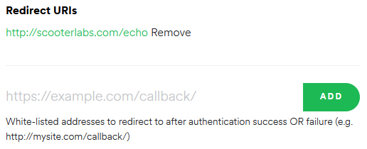

# playlistBot
> Discord bot that adds song links in a channel to a Spotify playlist

**Setup:**
1. Create a Discord bot application
2. Create a [Spotify Application](https://developer.spotify.com/dashboard/applications)
3. Set `Redirect URI` to `http://scooterlabs.com/echo` 
4. Create a Spotify playlist to add the songs to
5. Fill in `config.txt`

**Run:** `python3 bot.py`
